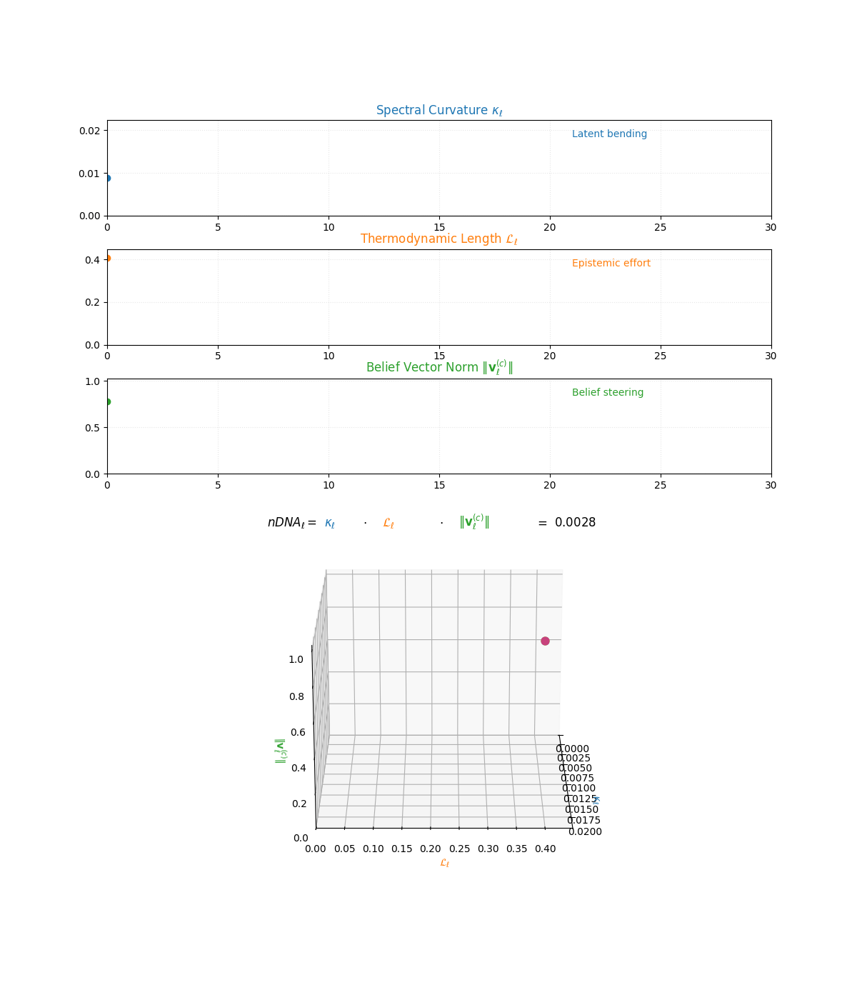
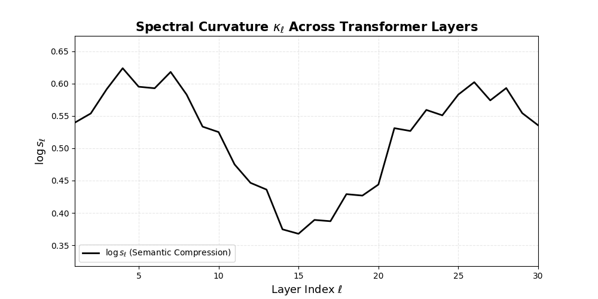
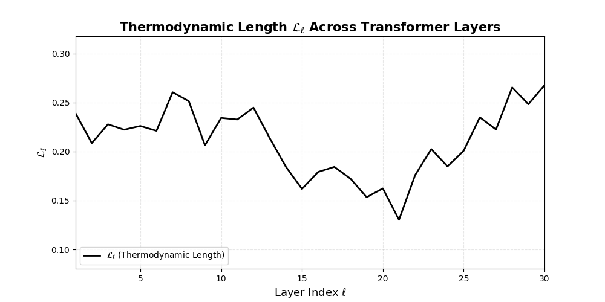
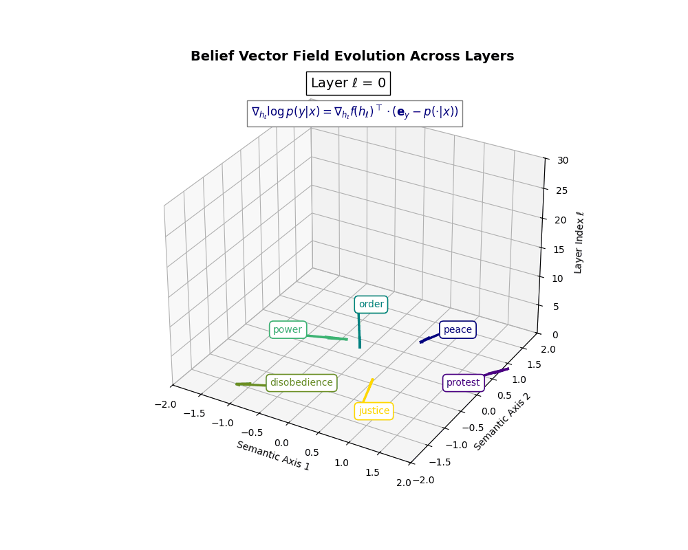
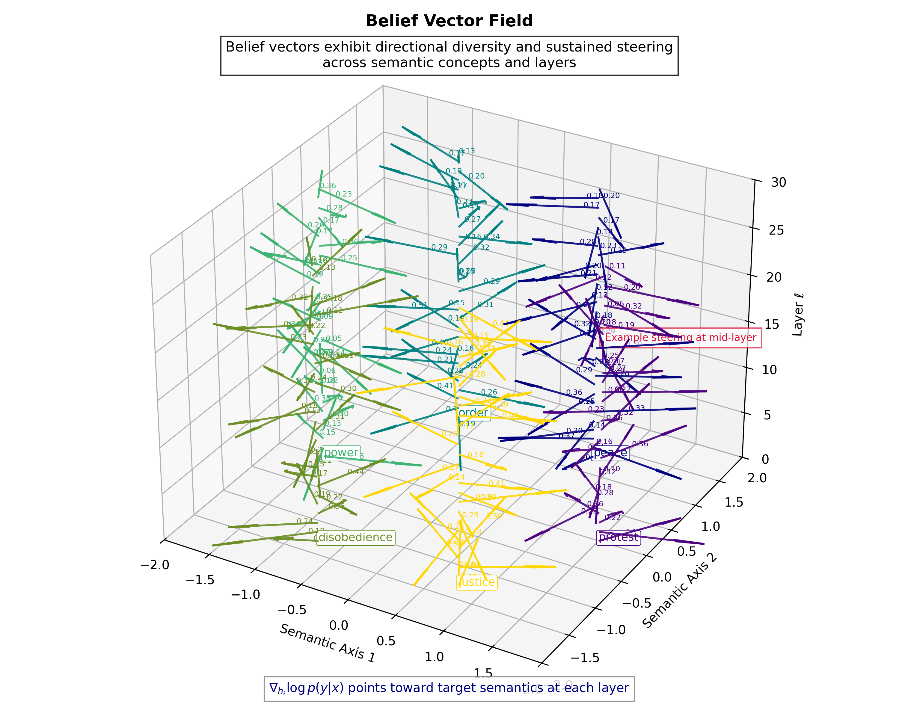

<p align="left">
  
</p>

# <p align="center"> Neural DNA: Latent Semantic Genome of Foundation Models </p>

<div align="center">
  <a href="https://pragyaai.github.io/ndna/llm/ndna/" style="background:linear-gradient(135deg,#0078E7,#00C6FF);color:white;padding:10px 26px;border-radius:10px;text-decoration:none;margin:0 30px;box-shadow:0 4px 10px rgba(0,0,0,0.15);">🌐 Webpage</a>
  <a href="https://www.youtube.com/@PragyaAI" style="background:linear-gradient(135deg,#FF0000,#FF4D4D);color:white;padding:10px 26px;border-radius:10px;text-decoration:none;margin:0 30px;box-shadow:0 4px 10px rgba(0,0,0,0.15);">🎥 YouTube</a>
  <a href="https://arxiv.org/abs/2509.18216" style="background:linear-gradient(135deg,#333,#777);color:white;padding:10px 26px;border-radius:10px;text-decoration:none;margin:0 30px;box-shadow:0 4px 10px rgba(0,0,0,0.15);">📄 ArXiv</a>
</div>


# nDNA :

Our unified framework establishes three fundamental metrics that collectively characterize the information processing landscape of Deep Neural Network in modern LLMs.<br>

**► 1. _Spectral Curvature_ ($$κ_{\ell}$$)**: Quantifies geometric properties of the parameter manifold <br><br>
**► 2. _Thermodynamic Length_ ($$L_{\ell}$$)**: Measures information processing complexity via Fisher-Rao distances <br><br>
**► 3. _Belief Vector Dynamics_**: Captures epistemic confidence and uncertainty propagation <br><br>


<p align="center">
  <a href="[https://pragyaai.github.io/ndna/thermodynamic_length.html]([https://cdn.jsdelivr.net/gh/pragyaai/cdn-assets/assets/ndna/ndna_refined_story.gif](https://cdn.jsdelivr.net/gh/pragyaai/cdn-assets/assets/ndna/ndna_refined_story.gif))">
    
  </a>
  <br><em>Overall Behaviour of all these metrics in modern LLMs</em>
</p>

The **Spectral metrics (αℓ, κℓ)** capture geometry, **thermodynamic length(Lℓ)** captures latent movement, and belief norm quantifies alignment strength of the model.

# Mathematical Foundation:

## **► 1. Spectral Curvature Analysis ($$κ_{\ell}$$):** <br>

A ramp up of Power-Law exponent will increase the Latent Binding in higher decoder layers, signaling sharper representational semantics. Spectral curvature at layer $\ell$ is defined as:

$$
\kappa_\ell := \big\| \Delta^2 h_\ell \big\| = \big\| h_{\ell+1} - 2 h_\ell + h_{\ell-1} \big\|
$$

In continuous form, this corresponds to:

$$
\kappa(s) = \left\| \frac{d^2 h(s)}{ds^2} \right\|
$$

where $s$ parameterizes depth through the network. Discrete $\kappa_\ell$ provides a practical, layerwise estimator.

<p align="center">
  <a href="[src="https://cdn.jsdelivr.net/gh/pragyaai/cdn-assets/assets/ndna/spectral_curvature_llama_ndna_animation.gif"](https://cdn.jsdelivr.net/gh/pragyaai/cdn-assets/assets/ndna/spectral_curvature_llama_ndna_animation.gif)">
    
  </a>
  <br><em>Spectral Curvature visualization</em>
</p>

<p align="center">
  <a href="[https://pragyaai.github.io/ndna/thermodynamic_length.html]([https://cdn.jsdelivr.net/gh/pragyaai/cdn-assets/assets/ndna/spectral_curvature.gif](https://cdn.jsdelivr.net/gh/pragyaai/cdn-assets/assets/ndna/spectral_curvature.gif))">
    
  </a>
  <br><em>Spectral Curvature accross Transformers Layers</em>
</p>

## **► 2. Thermodynamic length ($$L_{\ell}$$) Analysis** : <br> 

It is defined by Fisher geometry that quantifies semantic effort needed to move a token from layer($$\ell$$) to layer ($$\ell$$+1). Thermodynamic length offers a window onto the model’s "latent energy budget" — illuminating how internal belief states reshape to meet complexity, constraint, and context.

---

**Formulation**  
Let $p_\ell(y|x)$ denote the model’s conditional distribution at layer $\ell$ given input $x$. The local epistemic cost is reflected in the squared norm of the gradient of log-likelihood with respect to model parameters:

$$
\big\| \nabla_\theta \log p_\ell(x) \big\|^2
$$

This quantity measures how much the model must *adjust its parameters locally* at layer $\ell$ to improve its fit to input $x$.

**Thermodynamic length at layer $\ell$ is defined as:**

$$
\mathcal{L}_\ell := \sum_{x \in \mathcal{D}} \big\| \nabla_\theta \log p_\ell(x) \big\|^2
= |\mathcal{D}| \, \mathbb{E}_{x \sim \mathcal{D}} \big\| \nabla_\theta \log p_\ell(x) \big\|^2
$$

This formulation reveals that $$L_\ell$$ captures both the *average local effort* and its scaling with dataset size. Here $$h_\ell$$ denotes latent trajectories at layer $\ell$, $$G_{\mathrm{Fisher}}$$ is the Fisher information metric, and $$s$$ is the arc length along $\gamma_\ell$. Thus, $\mathcal{L}_\ell$ can be seen as an *energy integral over the belief manifold* — capturing how much *"heat"* or computational work is generated to reconcile prior belief state with new input at depth $\ell$.

<p align="center">
  <a href="[https://pragyaai.github.io/ndna/thermodynamics_interactive.html]([https://cdn.jsdelivr.net/gh/pragyaai/cdn-assets/assets/ndna/Final_thermodynamic_length.gif](https://cdn.jsdelivr.net/gh/pragyaai/cdn-assets/assets/ndna/Final_thermodynamic_length.gif))">
    
  </a>
  <br><em>Thermodynamic Length visualization</em>
</p>

<p align="center">
  <a href="[https://pragyaai.github.io/ndna/thermodynamic_length.html]([https://cdn.jsdelivr.net/gh/pragyaai/cdn-assets/assets/ndna/thermodynamic_length.gif](https://cdn.jsdelivr.net/gh/pragyaai/cdn-assets/assets/ndna/thermodynamic_length.gif))">
    
  </a>
  <br><em>Thermodynamic Length accross Transformers Layers</em>
</p>

This formulation reveals that $$L_{\ell}$$ captures both the *average local effort* and its scaling with dataset size. Furthermore, in differential geometric terms, thermodynamic length can be written as a path energy:

$$
\mathcal{L}_{\ell} = \int_{\gamma_{\ell}} \left\langle \frac{d h_{\ell}}{d s}, \mathcal{G}_{\text{Fisher}}(h_{\ell}) \frac{d h_{\ell}}{d s} \right\rangle d s
$$

where $$h_{\ell}$$ denotes latent trajectories at layer $$\ell$$, $$G_{\text{Fisher}}$$ the Fisher information metric, and s arc length along $$\gamma_{\ell}$$. Thus, $$L_{\ell}$$ can be seen as an *energy integral over the belief manifold* – capturing how much internal *"heat"* or computational work is generated to reconcile prior belief state with new input at depth $$\ell$$.


It quantifies the epistemic work performed across transformer layers, calculated as the cumulative squared gradient norm of layerwise log-likelihoods. Higher values signal internal resistance–zones of significant restructuring, belief compression, or negotiation of conflicting priors. In culturally fine-tuned models, these peaks localize to upper decoder layers, indicating intense adaptation near output-generating blocks. Within the nDNA construct, **$$L_{\ell}$$** helps reveal latent epistemic effort that underlies surface-level behavior. This metric thus provides a nuanced window into where and how models internally allocate effort during learning and inference. <br><br>

## **► 3. Belief Factors Calculation** : <br>
In **differential geometry** and **physics**, a *vector field* describes a directional force applied at each point of a space. Inspired by this, the **Belief Vector Field** models the *directional semantic force* that a specific culture or value system exerts on a model’s latent representations. It encodes *where*, *how strongly*, and *in what direction* cultural priors act within the model’s internal geometry—functioning as a **semantic compass** through the latent manifold.<br>

<p align="center">
  <a href="[https://pragyaai.github.io/ndna/belief_vector_field.html]([https://cdn.jsdelivr.net/gh/pragyaai/cdn-assets/assets/ndna/belief_vector_field.gif](https://cdn.jsdelivr.net/gh/pragyaai/cdn-assets/assets/ndna/belief_vector_field.gif))">
    
  </a>
  <br><em>Belied Vector Field Evolution across Layers</em>
</p>

<p align="center">
  
</p>

# Datasets Used

We have used **SQuAD 2.0** [dataset](https://huggingface.co/datasets/rajpurkar/squad_v2) for our experiments and analysis of these metrics.

# Models Evaluated

Throughout our work, we used the following foundational LLMs to prove our hypothesis:

## **► Dense transformers**  
##### 1. [LLaMA-2 base](https://huggingface.co/docs/transformers/en/model_doc/llama2)  
##### 2. [LLaMA-2 instruct](https://huggingface.co/upstage/Llama-2-70b-instruct)  
##### 3. [LLaMA-3 3B base](https://huggingface.co/meta-llama/Llama-3.2-3B)  
##### 4. [LLaMA-3 3B instruct](https://huggingface.co/meta-llama/Llama-3.2-3B-Instruct)  
##### 5. [Gemma 7B](https://huggingface.co/google/gemma-7b)  
##### 6. [Falcon](https://huggingface.co/docs/transformers/en/model_doc/falcon#transformers.FalconModel)  
##### 7. [GPT-2](https://huggingface.co/openai-community/gpt2)  
##### 8. [GPT-NeoX](https://huggingface.co/EleutherAI/gpt-neox-20b)  
##### 9. [DialoGPT-medium](https://huggingface.co/microsoft/DialoGPT-medium)  

## **► Sparse mixture-of-expert**  
##### 1. [Mixtral expert variants](https://huggingface.co/mistralai/Mixtral-8x7B-v0.1)  

## **► Multilingual and culturally calibrated models**  
##### 1. [Qwen2.5 base](https://huggingface.co/Qwen/Qwen2.5-72B)  
##### 2. [Qwen2.5 instruct](https://huggingface.co/unsloth/Qwen2.5-7B-Instruct)  

## **► Compact efficient architectures**  
##### 1. [Phi-2 base](https://huggingface.co/microsoft/phi-2)  
##### 2. [Phi-2 instruct](https://huggingface.co/venkycs/phi-2-instruct)  
##### 3. [TinyLLama](https://huggingface.co/TinyLlama/TinyLlama-1.1B-Chat-v1.0)  

<p align="center">
  <a href="[https://pragyaai.github.io/ndna/belief_vector_field.html]([https://cdn.jsdelivr.net/gh/pragyaai/cdn-assets/assets/gifs/15_llms/all.gif](https://cdn.jsdelivr.net/gh/pragyaai/cdn-assets/assets/gifs/15_llms/all.gif))">
    
  </a>
  <br><em>Belied Vector Field Evolution across Layers</em>
</p>

---

## Citation

If you use nDNA in your research, please cite:

```bibtex
@misc{das2025ndnasemantichelix,
  title={nDNA -- the Semantic Helix of Artificial Cognition}, 
  author={Amitava Das},
  year={2025},
  eprint={2509.18216},
  archivePrefix={arXiv},
  primaryClass={cs.AI},
  url={https://arxiv.org/abs/2509.18216}
}
